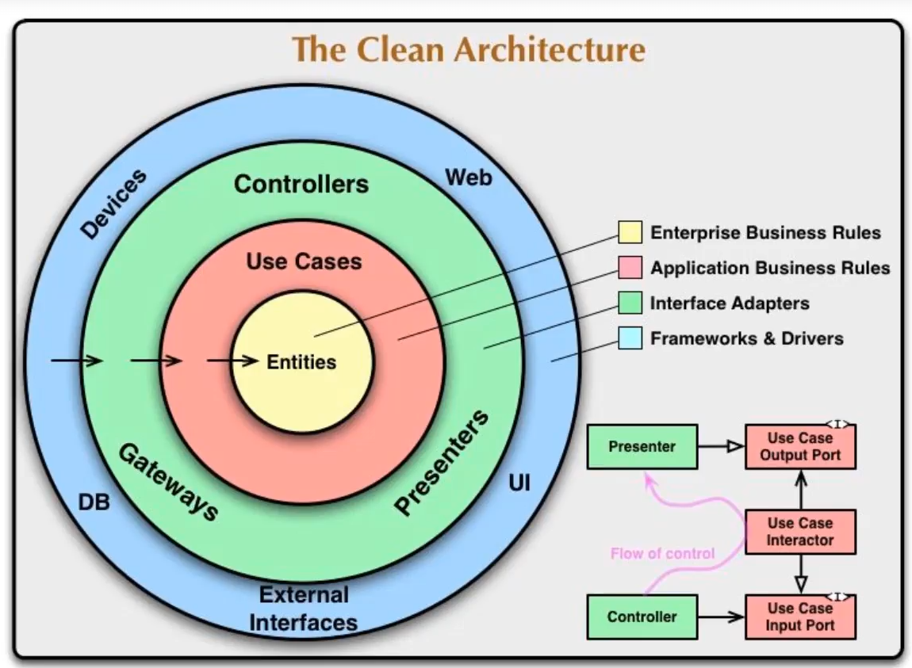

"# clean-architecture" 
# 🍺 Beer & User Management System

¡Bienvenido al **Beer Management System**! Este proyecto es una implementación de referencia de **Clean Architecture** (Arquitectura Limpia) utilizando las últimas capacidades de **.NET 9**.

El objetivo principal es demostrar cómo las reglas de negocio (Entidades y Casos de Uso) pueden permanecer aisladas de los detalles técnicos como la base de datos (SQL Server) o las interfaces de usuario (Web API, WinForms y Consola).

---

## 🏗️ Arquitectura del Sistema

El proyecto sigue el círculo de dependencias de Robert C. Martin, donde las dependencias siempre apuntan hacia adentro:


### 📁 Capas del Proyecto

1.  **`CA_EnterpriseLayer` (Dominio):** * El corazón del sistema. Contiene las entidades (`Beer`, `User`) libres de frameworks.
2.  **`CA_ApplicationLayer` (Casos de Uso):** * Orquestación de la lógica de negocio. Contiene los `UseCases` para Listar, Guardar, Actualizar y Eliminar, además de las interfaces de los repositorios.
3.  **`CA_InterfaceAdapters` (Adaptadores):**
    * **Data:** El contexto de Entity Framework Core y migraciones.
    * **Repository:** Implementación del patrón repositorio para SQL Server.
    * **Mappers/DTOs:** Transformación de datos entre capas.
    * **Presenters:** Formateo de datos para la interfaz de salida.
4.  **`CA_FrameworksDrivers` (Infraestructura):**
    * **Web API:** Minimal API con Swagger organizado por grupos.
    * **Windows Forms:** Aplicación de escritorio con Inyección de Dependencias nativa.
    * **Console App:** Cliente ligero para pruebas de persistencia.

---

## 🚀 Tecnologías y Patrones

* **Runtime:** .NET 9
* **Persistencia:** SQL Server + EF Core (Repository Pattern).
* **Inyección de Dependencias:** Contenedor nativo de Microsoft.Extensions.DependencyInjection.
* **Documentación:** Swagger/OpenAPI con etiquetas personalizadas (`WithTags`).
* **Manejo de Errores:** Middleware global de excepciones para respuestas JSON estandarizadas.

---

## 🛠️ Instalación y Configuración

### 1. Requisitos
* Visual Studio 2022 o VS Code.
* SDK de .NET 9.
* SQL Server (LocalDB o Express).

### 2. Base de Datos
Actualiza la cadena de conexión en el `appsettings.json` de la capa de API:

```json
"ConnectionStrings": {
  "ConexionSQLServer": "Server=TU_SERVIDOR;Database=BeerDB;Trusted_Connection=True;TrustServerCertificate=True;"
}
